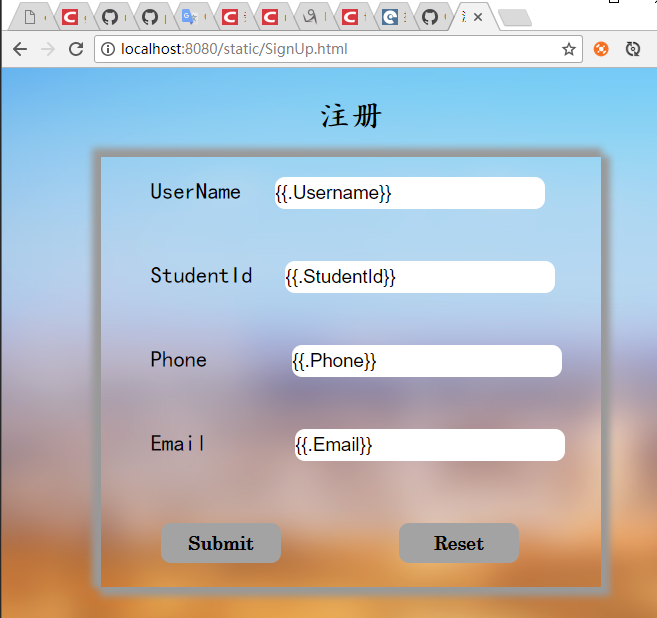

# 处理 web 程序的输入与输出

</br>

## 支持静态文件服务


解析：

`mx.PathPrefix("/static").Handler(http.StripPrefix("/static/",http.FileServer(http.Dir(webRoot+"/view/"))))`通过`StringPrefix`为所有静态文件访问路径加上独立前缀，它的含义是将 path 以 “/static” 前缀的 URL 都定位到 `webRoot + "/view/"` 为虚拟根目录的文件系统。 有必要描述这语句中的函数：

- `http.Dir` 是类型。将字符串转为 `http.Dir` 类型，这个类型实现了 `FileSystem` 接口。（Dir 不是函数）

- `http.FileServer()` 是函数，返回 `Handler` 接口，该接口处理 http 请求，访问 `root` 的文件请求。

- `mx.PathPrefix` 添加前缀路径路由。

  ​

效果图：

`url: localhost:8080/static/SignUp.html`



</br>

## 支持简单的js访问

regiser.go中的errorCheck:

```
func errorCheck(formatter *render.Render) http.HandlerFunc{
	iserror := true
	if len(errorMessageSlice) == 0{
		iserror = true
	}
	return func(w http.ResponseWriter, req *http.Request) {
		formatter.JSON(w, http.StatusOK, struct {
			ErrorSlice      []models.ErrorMessage`json:"errorslice"`
			IsError         bool`json:"iserror"`
        }{ErrorSlice: errorMessageSlice, IsError: iserror})
    }
}
```

errorcheck.js:

```
$(document).ready(function() {
    $.ajax({
        url: "/static/error"
    }).then(function(data) {
        if(data.iserror){
            for (var i=0;i<data.errorslice.length;i++){
                $('#'+ data.errorslice[i].Id).text(data.errorslice[i].Message);
            }
        }
    });
});
```

User.go:

```
package models

import(
	"regexp"
)

//user's model
type User struct {
	Username      string
	StudentId     string
	Phone         string
	Email         string
}

type ErrorMessage struct {
	Id            string
	Message       string
}

func IsAllValid(user User) []ErrorMessage{
	var errorMessageSlice []ErrorMessage
	if (isUsernameVaild(user.Username).Id != ""){
		errorMessageSlice = append(errorMessageSlice, isUsernameVaild(user.Username))
	}
	if (isStudentIdVaild(user.StudentId).Id != ""){
		errorMessageSlice = append(errorMessageSlice, isStudentIdVaild(user.StudentId))
	}
	if (isPhoneVaild(user.Phone).Id != ""){
		errorMessageSlice = append(errorMessageSlice, isPhoneVaild(user.Phone))
	}
	if (isEmailVaild(user.Email).Id != ""){
		errorMessageSlice = append(errorMessageSlice, isEmailVaild(user.Email))
	}
	return errorMessageSlice
}

func isUsernameVaild(username string) ErrorMessage{
	id := ""
	message := ""
	match, _ := regexp.MatchString(`[a-zA-Z]{1}\w{5,17}`, username)
	if !match {
		id = "errorname"
		message = "Attention:Username contains only a-z, A-Z or _, must begins with english letter, 6~8 characters"
	}
	return ErrorMessage{
		id, message,
	}
}

func isStudentIdVaild(stid string) ErrorMessage{
	id := ""
	message := ""
	match, _ := regexp.MatchString(`[^0]{1}\d{7}`, stid)
	if !match {
		id = "errorsid"
		message = "Attention:StudentId contains only 0~9, must begins without 0, 8 characters"
	}
	return ErrorMessage{
		id, message,
	}
}

func isPhoneVaild(phone string) ErrorMessage{
	id := ""
	message := ""
	match, _ := regexp.MatchString(`^(1[3|4|5|8][0-9]\d{4,8})$`, phone)
	if !match {
		id = "errorphone"
		message = "Attention:Phone contains only 0~9, must begins without 0, 11 characters"
	}
	return ErrorMessage{
		id, message,
	}
}

func isEmailVaild(username string) ErrorMessage{
	id := ""
	message := ""
	match, _ := regexp.MatchString(`^([\w\.\_]{2,10})@(\w{1,}).([a-z]{2,4})$`, username)
	if !match {
		id = "erroremail"
		message = "Attention:Email isn't allowed"
	}
	return ErrorMessage{
		id, message,
	}
}

```

解析：

在这里，定义两个个结构体

```
type User struct {
	Username      string
	StudentId     string
	Phone         string
	Email         string
}
type ErrorMessage struct {
	Id            string
	Message       string
}
```

一个用来存储用户信息，一个用来存储用户的错误信息，通过正则表达式判断用户输入的信息是否符合规范要求，从而选择是否生成错误信息的slice。接着，调用一个

`mx.HandleFunc("/static/error", errorCheck(formatter)).Methods("GET")`方法，当加载页面时，js文件会访问`/static/error`路由，获得该页面返回的错误信息，然后将错误信息填写到html模板对应的位置。

效果图[显示错误信息]：


</br>

## 提交表单，并输出一个表格

SignUp.html模板：

```
<!DOCTYPE html>
<html>
<head>
	<meta http-equiv="Content-Type" content="text/html; charset=utf-8" />
	<title>注册</title>
	<link rel="stylesheet" type="text/css" href="css/SignUp.css" />
	<script src="js/SignUpJquery.js"></script>
	<script src="js/errorcheck.js"></script>
</head>
<body>
	<h1>注册</h1>
	<div id="signup_area">
		<form action="/static/register"method="post" accept-charset="utf-8">
			<div id="username_area">
				<label>UserName<input type="text" id="text1" class="usermessage" name="name" value={{.Username}}></label>
				<p id="errorname" class="error"></p>
			</div>
			<div id="sid_area">
				<label>StudentId<input type="text" id="text2" class="usermessage" name="id" value={{.StudentId}}></label>
				<p id="errorsid" class="error"></p>
			</div>
			<div id="phone_area">
				<label>Phone<input type="text" id="text3" class="usermessage" name="phone" value={{.Phone}}></label>
				<p id="errorphone" class="error"></p>
			</div>
			<div id="email_area">
				<label>Email<input type="text" id="text4" class="usermessage" name="email" value={{.Email}}></label>
				<p id="erroremail" class="error"></p>
			</div>
			<input type="submit" id="submission" value="Submit" />
			<input type="reset" id="resetting" value="Reset" />
		</form>
	</div>
</body>
</html>
```

Detail.html模板：

```
<html>
<head>
	<meta http-equiv="Content-Type" content="text/html; charset=utf-8" />
	<title>Detail</title>
	<link rel="stylesheet" type="text/css" href="css/SignUp.css" />
</head>
<body>
	<h1>Detail</h1>
	<div id="detail_area">
		<form action="postlogin" method="post" accept-charset="utf-8">
			<div id="username_area">
				<label>UserName<input type="text" id="text1" class="showmessage" onfocus="this.blur()" name="name" value={{.Username}}></label>
				<p id="errorname" class="error"></p>
			</div>
			<div id="sid_area">
				<label>StudentId<input type="text" id="text2" class="showmessage" onfocus="this.blur()" name="id" value={{.StudentId}}></label>
				<p id="errorsid" class="error"></p>
			</div>
			<div id="phone_area">
				<label>Phone<input type="text" id="text3" class="showmessage" onfocus="this.blur()" name="phone" value={{.Phone}}></label>
				<p id="errorphone" class="error"></p>
			</div>
			<div id="email_area">
				<label>Email<input type="text" id="text4" class="showmessage" onfocus="this.blur()" name="email" value={{.Email}}></label>
				<p id="erroremail" class="error"></p>
			</div>
		</form>
	</div>
</body>
</html>
```

register.go中的register：

```
func register(w http.ResponseWriter, r *http.Request){
	r.ParseForm() 
	if r.Method == "POST"{
		user := &models.User{
			r.Form["name"][0],
			r.Form["id"][0],
			r.Form["phone"][0],
			r.Form["email"][0],
		}
		errorMessageSlice = models.IsAllValid(*user)
		if(len(errorMessageSlice) == 0){
			t, _ := template.ParseFiles("./view/Detail.html")
			t.Execute(w, *user)
		}else{
			t, _ := template.ParseFiles("./view/SignUp.html")
			t.Execute(w, *user)
		}
	}else{
		errorMessageSlice = nil
		t, _ := template.ParseFiles("./view/SignUp.html")
		t.Execute(w, nil)
	}
}
```

解析：

通过在service.go中调用`mx.HandleFunc("/static/register", register)`来进行表单处理，点击注册按钮时，网页访问`/static/register`，然后调用`register`函数，将请求中的表单信息进行解析，判断是否符合输入规范，不符合则停留在注册页面，并显示错误信息，否在跳转到详情页面，显示输入的信息

效果图：

注册失败：


注册成功：


</br>

##对`/unknown`给出开发中的提示，返回码5xx

error.go:

```
package service

import(
	"net/http"
)

func NotImplemented(w http.ResponseWriter, r *http.Request){
	http.Error(w, "501 Not Implemented", 501)
}

func NotImplementedHandler() http.Handler{
	return http.HandlerFunc(NotImplemented)
}
```

这里的NotImplemented和NotImplementedHandler函数是模仿NotFound和NotFoundHandler函数实现的，通过调用`http.Error()`函数，对状态码和错误信息进行设置

效果图：


</br>

##编写中间件，实现编码转换

```
package service

import(
	"net/http"
	"github.com/axgle/mahonia"
)

func midwareGbk(rw http.ResponseWriter, r *http.Request, next http.HandlerFunc) {
	r.ParseForm()
	if len(r.Form) != 0{
		for k, _ := range r.Form {
			enc := mahonia.NewEncoder("utf-8")
			r.Form[k][0] = enc.ConvertString(r.Form[k][0])
		}
	}
	next(rw, r)
	// do some stuff after
  }
```

对请求中表单的数据统一进行utf-8格式转换，转成utf-8输出，这里使用到了`"github.com/axgle/mahonia"`这个库，`enc := mahonia.NewEncoder("utf-8")`定义了编码的类型

效果图：

